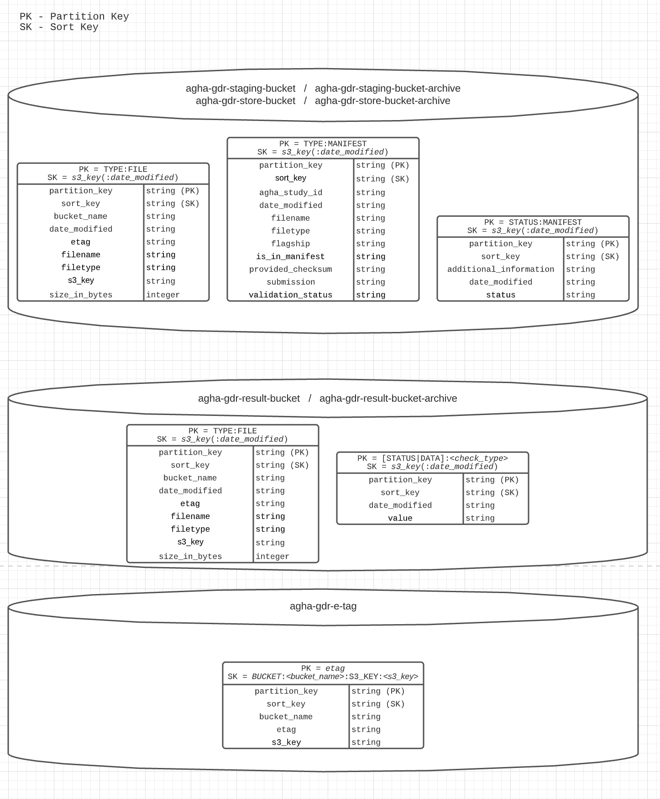

# AGHA data validation stack
This stack is used to handle and validate data received as part of the AGHA GDR project. The primary functions are:
1. take receipt of genomic files in a staging area
2. validate genomic files, and generate indexes if required
3. store file validation results in a database
4. move genomic files to a data store along with indexes _[planned]_
5. generate validation reports _[planned]_

## Table of contents
* [Schematic](#schematic)
* [How it works](#how-it-works)
* [Prerequisites](#prerequisites)
* [Deployment](#deployment)
* [Usage](#usage)
* [Lambda](#lambda)
* [DynamodDb](#dynamodb)
* [Batch](#batch)
* [Lambda Arguments](#lambda-arguments)

## Schematic
<p align="center"></p>

## How it works
In summary, 

1. Every uploaded file in the bucket 
   1. A dynamodb record store file metadata for easy access.
2. If manifest uploaded to the staging bucket
   1. The bucket change the submission to read-only
   2. Manifest check are triggered
   3. Notification is triggered to the data manager, and submitter.
   4. File validation through _AWS batch job_ with the [python script](https://github.com/umccr/agha-data-validation-scripts) at is triggered.
3. When triggered batch job triggered
   1. Results and logs are output to the result bucket
   2. Event listener will read these files and input to dynamodb for easy file access.
4. When all run accordingly, moving could start by invoking _data_transfer_manager_ lambda
   1. It will remove bucket locks
   2. Copy data over, including maniefst record at staging bucket
   3. Trigger move operation via AWS CLI in batch

_NOTE: Validation script is located at a different repository. Repository: [UMCCR/agha-data-validation-scripts](https://github.com/umccr/agha-data-validation-scripts)_

## Prerequisites
It is assumed that the necessary VPC and S3 buckets are appropriately deployed and configured in the target
AWS account.

The names of these variables are defined at the **stack_props** variables in app.py.

## Deployment
The stack has some software requirements for deploy:
* AWS CDK Toolkit (available through Homebrew or npm)
* Docker
* Python3

### Create virtual environment
```bash
python3 -m venv .venv/
pip install -r requirements.txt
```

### Configure
The cdk application will mostly configure the infrastructure as shown in the picture. Just make sure constants props 
defined in app.py are correct.

### Deploy stack
The stack contain a pipeline will take source code from the repository and self-update the pipeline when new 
code commit is detected to this repository. Initialize setup of pipeline is necessary and only be done once.

```bash
cdk deploy AGHADynamoDBStack
cdk deploy AGHAValidationCodePipeline
```
Make sure to setup aws profile by `export AWS_PROFILE=${PROFIE_NAME}` or add `--porfile=${PROFIE_NAME}` flag

The app have three stacks:
- **AGHADynamoDBStack** - The stack for dynamodb table only. Need to be defined once and is seperated from all other stacks.
- **AGHAValidationCodePipeline** - The stack for the self-update codepipeline and will listen to GitHub commit event.
- **AGHAValidationCodePipeline/AGHAValidationPipelineStage/agha-gdr-validation-pipeline** -  The application stack where all resources to run the pipeline are defined here.


###### Deploying Manually [Not Necessary]

You could skip this part if you do not want to deploy this manyually.

The application stack could be compiled and deployed manually, with the pre-requisite _AGHADynamoDBStack_ stack must be deployed once before deploying manually.

To deploy Manually, please make sure lambda layers are correctly build and in the correct location. The following command is to build the layers. (Please make sure docker are available.)
```
for dir in $(find ./lambdas/layers/ -maxdepth 1 -mindepth 1 -type d);do /bin/bash ./build_lambda_layers.sh ${dir}; done
```
Then to deploy the application stack
```
cdk deploy AGHAValidationCodePipeline/AGHAValidationPipelineStage/agha-gdr-validation-pipeline
```
Again, make sure aws profile is correctly set up as mentioned above.


## Usage
### Automatic triggering (manifest file uploaded)
Incoming data should be uploaded under an accepted flagship code and date/time stamp directory e.g. `Cardiac/2021_08_25/`. 
There are bucket policy that defined the accepted flagship code to prevent any duplicated flagships.

Upload the corresponding submissions with `manifest.txt` to be uploaded the last. This is important as it will lock the bucket
from further upload, and will trigger the downstream process.

This Lambda function when manifest is uploaded:
* Add bucket policy to read-only
* Validate manifest data structure (e.g. correct format, no black data)
* Send notification about the submission.
* Create records in DynamoDB for file properties along with manifest data for ease of access
* Run validate validate file batch job (if automation is enabled)

The validation results, logs, and indexes are uploaded to the results S3 bucket using a key prefix matching the input
`manifest.txt` and with run directory e.g. `Cardiac/2021_08_25/<rundate>_<runtime>_<uid>/`.

### Manual triggering

In general, all lambdas could be run manually with a specific payload. This is useful if lambdas have an error, or any of 
the validation needs any re-triggering to be done.

### Lambda
##### Functions
A quick summary for each function.
- **s3_event_router** - This is for the staging bucket to redirect which lambda invokes for the particular event emitted by S3. 
  - Manifest file event, would trigger `folder-lock` lambda and `manifest_processor` lambda.
  - All events, would trigger `s3_event_recorder` lambda
- **folder_lock** - would lock (prevent put/delete) directory from the event received
- **notification** - would send messages via email/slack with the given payload.
- **manifest_processor:** Would do a quick validation from the manifest received. The lambda would update dynamodb from the manifest.txt content for easy access via DynamoDb. In general, the lambda would do the following:
  - Add manifest data (agha_study_id and checksum) to DynamoDB
  - Check if all data in manifest exist
  - Check if the same eTag has existed (warn and pause if exist) 
  - Check if the manifest has complete/correct data/format
  - Trigger `notification` lambda for the validation result
  - If enabled, trigger `file_validation_manager` lambda to create batch job for the files.
- **s3_event_recorder** - Would record s3 event and update Dynamodb accordingly. This gives ease of access to lookup from DynamoDb than opening individual files.
  - Record file properties across all bucket. (such as filetype, filesize, filename) 
  - Record the content of the data in the result bucket.(such as results from validation).
- **file_validation_manager** - This will trigger validation batch job. This will take data from the manifest record created in `manifest_processor` lambda.
- **data_transfer_manager** - This will trigger `data_transfer` batch job. 
  - Will check all data has exit successfully from batch job
  - Will check results produced from the batch job succeed
  - Unlock s3 policy (set by the folderlock lambda)
  - Trigger data transfer batch job.
  - Update DynamoDb from the staging bucket

_*arguments are defined below_

##### Lambdas layer
- runtime: contain all runtime library
- util:
  - init: for general use of the project
  - agha: All related to AGHA context. This includes codes, preferred code, filetype accepted
  - batch: All related to batch context for the project from creating batch job, submitting a batch job
  - dynamodb: This includes all schema used for the dynamodb along with static function for the class, function to update/delete items
  - s3: Function used to access s3 resource
  - notification: This contains all logging that integrates with invoking notification lambdas

### Batch
- **s3_validation:** This will trigger validation submitted through the pipeline. For time being, checks are: checksum, validate filetype, and create_index. (Script)[https://github.com/umccr/agha-data-validation-scripts].
- **data_transfer_manager:** This would use AWS/CLI Image and use MV command to move data from staging to store

### Dynamodb
There are 7 tables for this pipeline which include archive tables.
<p align="center"></p>

### Lambda Arguments

The following are arguments supported on each lambda.

##### data_transfer_manager

| Argument                   | Description                                        | Type              | Example                         |
|----------------------------|----------------------------------------------------|-------------------|---------------------------------|
| submission [REQUIRED]      | Submission date in the flagship                    | String            | "13023_3432423"                 |
| flagship_code [REQUIRED]   | Flagship code                                      | String            | "ACG"                           |
| skip_unlock_bucket         | Allow skipping unlocking bucket                    | Boolean of string | "true"                          |
| skip_submit_batch_job      | Allow skipping submitting batch job                | Boolean of string | "true"                          |
| skip_update_dynamodb       | Allow skipping dynamodb update                     | Boolean of string | "true"                          |
| validation_check_only      | Only validation check only and return fail result. | Boolean of string | "true"                          |
| exception_postfix_filename | Skip move file for the following list of postfix   | List of string    | ["metadata.txt", ".md5", etc.], |


  

##### manifest_processor
| Argument                   | Description                                   | Type              | Example                            |
|----------------------------|-----------------------------------------------|-------------------|------------------------------------|
| bucket_name [REQUIRED]     | Bucket name to check                          | String            | "somebucketname"                   |
| manifest_fp [REQUIRED]     | Manifest filepath                             | String            | "FLAGSHIP/SUBMISSION/manifest.txt" |
| email_report_to            | Configure this for email notification         | String            | "john.doe@email.com"               |
| skip_auto_validation       | Disable triggering validation manager lambda  | Boolean of string | "true"                             |
| skip_update_dynamodb       | Allow skipping dynamodb update                | Boolean of string | "true"                             |
| skip_send_notification     | Allow skipping notification trigger           | Boolean of string | "true"                             |
| skip_checksum_validation   | Allow skipping checksum validation            | Boolean of string | "true"                             |
| exception_postfix_filename | Skip checking on file in this list of postfix | List of string    | ["metadata.txt", ".md5", etc.]     |


##### validation_manager
There are some combination of required arguments allowed
Structured #1

| Argument               | Description        | Type           | Example                            |
|------------------------|--------------------|----------------|------------------------------------|
| manifest_fp [REQUIRED] | Manifest filepath  | String         | "FLAGSHIP/SUBMISSION/manifest.txt" |
| include_fns [REQUIRED] | Included filepaths | List of string | ["sample.bam"]                     |

Structure #2

| Argument                 | Description                                   | Type           | Example                            |
|--------------------------|-----------------------------------------------|----------------|------------------------------------|
| output_prefix [REQUIRED] | Where the output in the result bucket will go | String         | "FLAGSHIP/20210824_manual_run/"    |
| filepaths [REQUIRED]     | Included filepaths                            | List of string | ["FLAGSHIP/SUBMISSION/sample.bam"] |

Structure #3

| Argument                                | Description       | Type   | Example                            |
|-----------------------------------------|-------------------|--------|------------------------------------|
| manifest_fp [REQUIRED]                  | Manifest filepath | String | "FLAGSHIP/SUBMISSION/manifest.txt" |
| manifest_dynamodb_key_prefix [REQUIRED] | Submission prefix | String | "cardiac/20210711_170230/"         |

Optional Arguments

| Argument                   | Description                                                                                                                                              | Type              | Example                        |
|----------------------------|----------------------------------------------------------------------------------------------------------------------------------------------------------|-------------------|--------------------------------|
| skip_update_dynamodb       | Allow skipping dynamodb update                                                                                                                           | Boolean of string | "true"                         |
| tasks_skipped              | Allow skipping some tasks. By default, it will run all tasks. List of tasks: ['CHECKSUM_VALIDATION','FILE_VALIDATION','CREATE_INDEX', 'CREATE_COMPRESS'] | List of string    | ['CHECKSUM_VALIDATION']        |
| exception_postfix_filename | Skip checking on file in this list of postfix                                                                                                            | List of string    | ["metadata.txt", ".md5", etc.] |


#### Invoke function example
```bash
aws lambda invoke \
    --function-name {function_name} \
    --cli-binary-format raw-in-base64-out \
    --payload '{
      "manifest_fp": "Cardiac/20210711_170230/manifest.txt",
      "manifest_dynamodb_key_prefix": "Cardiac/20210711_170230/"
    }' \
    response.json
```
NOTE: If `aws --version` is in version 1 (aws-cli/1.X.XX), `--cli-binary-format raw-in-base64-out` flag may not be necessary.

