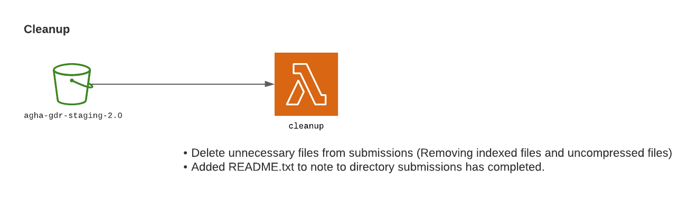

# AGHA data validation stack

This is the active branch of the pipeline (version 2).
---
This stack is used to handle and validate data received as part of the AGHA GDR project. The primary functions are:

1. take receipt of genomic files in a staging area
2. validate genomic files, and generate indexes if required
3. store file validation results in a database
4. move genomic files to a data store along with indexes _[planned]_
5. generate validation reports _[planned]_

## Table of contents

* [S3 Data Sharing](#s3-data-sharing)
* [Schematic](#schematic)
* [How it works](#how-it-works)
* [Prerequisites](#prerequisites)
* [Deployment](#deployment)
* [Usage](#usage)
* [Lambda](#lambda)
* [Database (DynamoDb)](#database)
* [Batch](#batch)
* [Lambda Arguments](#lambda-arguments)

## S3 Data Sharing

We support S3 data sharing for data in store to other S3 in the same `ap-southeast-2` region. Instructions are at the
docs folder ([click here](./docs/gdr-s3-data-sharing.md)).

## Schematic

<p align="center"></p>

## How it works

In summary,

1. Every uploaded file in the bucket
    1. A dynamodb record store file metadata for easy access.
2. If manifest uploaded to the staging bucket
    1. The bucket change the submission to read-only
    2. Manifest check are triggered
    3. Notification is triggered to the data manager, and submitter.
    4. File validation through _AWS batch job_ with
       the [python script](https://github.com/umccr/agha-data-validation-scripts) at is triggered.
3. When triggered batch job triggered
    1. Results and logs are output to the result bucket
    2. Event listener will read these files and input to dynamodb for easy file access.
4. When all run accordingly, moving could start by invoking _data_transfer_manager_ lambda
    1. It will remove bucket locks
    2. Copy data over, including maniefst record at staging bucket
    3. Trigger move operation via AWS CLI in batch

_NOTE: Validation script is located at a different repository.
Repository: [UMCCR/agha-data-validation-scripts](https://github.com/umccr/agha-data-validation-scripts)_

## Simpler Diagrams

This diagram will describe each flows.
<p align="center"></p>
<p align="center"></p>
<p align="center"></p>
<p align="center"></p>

## Prerequisites

It is assumed that the necessary VPC and S3 buckets are appropriately deployed and configured in the target AWS account.

The names of these variables are defined at the **stack_props** variables in app.py.

## Deployment

The stack has some software requirements for deploy:

* AWS CDK Toolkit (available through Homebrew or npm)
* Docker
* Python3

### Configure

The cdk application will mostly configure the infrastructure as shown in the picture. Just make sure constants props
defined in app.py are correct.

### Deploy stack

The stack contain a pipeline will take source code from the repository and self-update the pipeline when new code commit
is detected to this repository. Initialize setup of pipeline is necessary and only be done once.

```bash
cdk deploy AGHADynamoDBStack
cdk deploy AGHAValidationCodePipeline
```

Make sure to setup aws profile by `export AWS_PROFILE=${PROFIE_NAME}` or add `--porfile=${PROFIE_NAME}` flag

The app have three stacks:

- **AGHADynamoDBStack** - The stack for dynamodb table only. Need to be defined once and is seperated from all other
  stacks.
- **AGHAValidationCodePipeline** - The stack for the self-update codepipeline and will listen to GitHub commit event.
- **AGHAValidationCodePipeline/AGHAValidationPipelineStage/agha-gdr-validation-pipeline** - The application stack where
  all resources to run the pipeline are defined here.

###### Deploying Manually [Not Necessary]

You could skip this part if you do not want to deploy this manyually.

The application stack could be compiled and deployed manually, with the pre-requisite _AGHADynamoDBStack_ stack must be
deployed once before deploying manually.

To deploy Manually, please make sure lambda layers are correctly build and in the correct location. The following
command is to build the layers. (Please make sure docker are available.)

```
for dir in $(find ./lambdas/layers/ -maxdepth 1 -mindepth 1 -type d);do /bin/bash ./build_lambda_layers.sh ${dir}; done
```

Then to deploy the application stack

```
cdk deploy AGHAValidationCodePipeline/AGHAValidationPipelineStage/agha-gdr-validation-pipeline
```

Again, make sure aws profile is correctly set up as mentioned above.

###### Local Development

###### # Setting Up

Create virtual enviroment

```bash
python3 -m venv .venv
```

To activate it

```bash
source .venv/bin/activate
```

Install dependencies

```bash
make install
```

###### # Running DynamoDb locally

Run Dynamodb locally

```bash
make up
make build
```

To load some mock-data.

```bash
make loaddata
```

###### # Finishing

To shut local development

```bash
make down
```

## Usage

### Automatic triggering (manifest file uploaded)

Incoming data should be uploaded under an accepted flagship code and date/time stamp directory
e.g. `Cardiac/2021_08_25/`. There are bucket policy that defined the accepted flagship code to prevent any duplicated
flagships.

Upload the corresponding submissions with `manifest.txt` to be uploaded the last. This is important as it will lock the
bucket from further upload, and will trigger the downstream process.

This Lambda function when manifest is uploaded:

* Add bucket policy to read-only
* Validate manifest data structure (e.g. correct format, no black data)
* Send notification about the submission.
* Create records in DynamoDB for file properties along with manifest data for ease of access
* Run validate validate file batch job (if automation is enabled)

The validation results, logs, and indexes are uploaded to the results S3 bucket using a key prefix matching the input
`manifest.txt` and with run directory e.g. `Cardiac/2021_08_25/<rundate>_<runtime>_<uid>/`.

### Manual triggering

In general, all lambdas could be run manually with a specific payload. This is useful if lambdas have an error, or any
of the validation needs any re-triggering to be done.

### Lambda

##### Functions

A quick summary for each function.

- **s3_event_router** - This is for the staging bucket to redirect which lambda invokes for the particular event emitted
  by S3.
    - Manifest file event, would trigger `folder-lock` lambda and `manifest_processor` lambda.
    - All events, would trigger `s3_event_recorder` lambda
- **folder_lock** - would lock (prevent put/delete) directory from the event received
- **notification** - would send messages via email/slack with the given payload.
- **manifest_processor:** Would do a quick validation from the manifest received. The lambda would update dynamodb from
  the manifest.txt content for easy access via DynamoDb. In general, the lambda would do the following:
    - Add manifest data (agha_study_id and checksum) to DynamoDB
    - Check if all data in manifest exist
    - Check if the same eTag has existed (warn and pause if exist)
    - Check if the manifest has complete/correct data/format
    - Trigger `notification` lambda for the validation result
    - If enabled, trigger `file_validation_manager` lambda to create batch job for the files.
- **s3_event_recorder** - Would record s3 event and update Dynamodb accordingly. This gives ease of access to lookup
  from DynamoDb than opening individual files.
    - Record file properties across all bucket. (such as filetype, filesize, filename)
    - Record the content of the data in the result bucket.(such as results from validation).
- **file_validation_manager** - This will trigger validation batch job. This will take data from the manifest record
  created in `manifest_processor` lambda.
- **data_transfer_manager** - This will trigger `data_transfer` batch job.
    - Will check all data has exit successfully from batch job
    - Will check results produced from the batch job succeed
    - Unlock s3 policy (set by the folderlock lambda)
    - Trigger data transfer batch job.
    - Update DynamoDb from the staging bucket
- **Cleanup** - Will cleanup Staging bucket data
    - Delete unnecessary files from submissions (Removing indexed files and uncompressed files)
    - Added README.txt to note to directory submissions has completed.
- **Report** - Will generate report from dynamoDb/Bucket
    - Could check if all files listed in orignal manifest file is in STORE bucket
    - Could check staging file should only contain indexed and uncompressed files
    - Could give report wich submission are ready to be transferred by the data-transfer-manager lambda
- **batch_notification** - Will notify via slack when batch job completed
    - The lambda will notify when batch job has completed with validation or have completed move from staging to store
      bucket.
    - The lambda will be invoked after updating dynamodb (s3_event_recorder lambda)
- **gdr_s3_data_sharing** - Will share data via s3 from store bucket to destination bucket
    - The lambda will add new policy to batch instance role for s3-data-sharing.
    - The lambda will create and submit batch job to copy over files to s3.
      _*arguments are defined below_

##### Lambdas layer

- runtime: contain all runtime library
- util:
    - init: for general use of the project
    - agha: All related to AGHA context. This includes codes, preferred code, filetype accepted
    - batch: All related to batch context for the project from creating batch job, submitting a batch job
    - dynamodb: This includes all schema used for the dynamodb along with static function for the class, function to
      update/delete items
    - s3: Function used to access s3 resource
    - notification: This contains all logging that integrates with invoking notification lambdas

### Batch

- **s3_validation:** This will trigger validation submitted through the pipeline. For time being, checks are: checksum,
  validate filetype, and create_index. (Script)[https://github.com/umccr/agha-data-validation-scripts].
- **data_transfer_manager:** This would use AWS/CLI Image and use MV command to move data from staging to store
- **gdr_s3_data_sharing:** This would use AWS/CLI Image and use the CP command to copy files from store bucket to other
  specified bucket.

### Lambda Arguments

The following are arguments supported on each lambda. Recommended invoking lambda asynchronously.

### data_transfer_manager

| Argument                    | Description                                                                                                                            | Type           | Example                        |
|-----------------------------|----------------------------------------------------------------------------------------------------------------------------------------|----------------|--------------------------------|
| submission [REQUIRED]       | Submission date in the flagship                                                                                                        | String         | "13023_3432423"                |
| flagship_code [REQUIRED]    | Flagship code                                                                                                                          | String         | "ACG"                          |
| run_all                     | To confirm all event will run. If this is false or do not exist. Skipped/validation_check arguments below are expected in the payload. | Boolean        | true                           |
| skip_submit_batch_job       | Allow skipping submitting batch job                                                                                                    | Boolean        | true                           |
| skip_update_dynamodb        | Allow skipping dynamodb update                                                                                                         | Boolean        | true                           |
| skip_generate_manifest_file | Allow skipping generating new `manifest.txt file` from manifest dynamodb.                                                              | Boolean        | true                           |
| validation_check_only       | Only validation check only and return fail result.                                                                                     | Boolean        | true                           |
| exception_postfix_filename  | Skip move file for the following list of postfix                                                                                       | List of string | ["metadata.txt", ".md5", etc.] |

### manifest_processor

| Argument                   | Description                                   | Type           | Example                            |
|----------------------------|-----------------------------------------------|----------------|------------------------------------|
| bucket_name [REQUIRED]     | Bucket name to check                          | String         | "somebucketname"                   |
| manifest_fp [REQUIRED]     | Manifest filepath                             | String         | "FLAGSHIP/SUBMISSION/manifest.txt" |
| email_report_to            | Configure this for email notification         | String         | "john.doe@email.com"               |
| skip_auto_validation       | Disable triggering validation manager lambda  | Boolean        | true                               |
| skip_update_dynamodb       | Allow skipping dynamodb update                | Boolean        | true                               |
| skip_send_notification     | Allow skipping notification trigger           | Boolean        | true                               |
| skip_checksum_validation   | Allow skipping checksum validation            | Boolean        | true                               |
| exception_postfix_filename | Skip checking on file in this list of postfix | List of string | ["metadata.txt", ".md5", etc.]     |

### validation_manager

There are multiple ways to trigger this function, defined as follows. Optional arguments can be used on top of the
primary arguments.

Structure #1

| Argument               | Description        | Type           | Example                            |
|------------------------|--------------------|----------------|------------------------------------|
| manifest_fp [REQUIRED] | Manifest filepath  | String         | "FLAGSHIP/SUBMISSION/manifest.txt" |
| include_fns [REQUIRED] | Included filepaths | List of string | ["sample.bam"]                     |

Structure #2

| Argument                 | Description                                   | Type           | Example                            |
|--------------------------|-----------------------------------------------|----------------|------------------------------------|
| output_prefix [REQUIRED] | Where the output in the result bucket will go | String         | "FLAGSHIP/20210824_manual_run/"    |
| filepaths [REQUIRED]     | Included filepaths                            | List of string | ["FLAGSHIP/SUBMISSION/sample.bam"] |

Structure #3

| Argument                                | Description       | Type   | Example                            |
|-----------------------------------------|-------------------|--------|------------------------------------|
| manifest_fp [REQUIRED]                  | Manifest filepath | String | "FLAGSHIP/SUBMISSION/manifest.txt" |
| manifest_dynamodb_key_prefix [REQUIRED] | Submission prefix | String | "cardiac/20210711_170230/"         |

Optional Arguments

| Argument                   | Description                                                                                                                                              | Type           | Example                        |
|----------------------------|----------------------------------------------------------------------------------------------------------------------------------------------------------|----------------|--------------------------------|
| skip_update_dynamodb       | Allow skipping dynamodb update                                                                                                                           | Boolean        | true                           |
| tasks_skipped              | Allow skipping some tasks. By default, it will run all tasks. List of tasks: ['CHECKSUM_VALIDATION','FILE_VALIDATION','CREATE_INDEX', 'CREATE_COMPRESS'] | List of string | ['CHECKSUM_VALIDATION']        |
| exception_postfix_filename | Skip checking on file in this list of postfix                                                                                                            | List of string | ["metadata.txt", ".md5", etc.] |

### report

| Argument               | Description                                                                                           | Type   | Example             |
|------------------------|-------------------------------------------------------------------------------------------------------|--------|---------------------|
| report_type [REQUIRED] | What kind of report needed, Options: ['file_transfer_check','passed_validation', 'store_bucket_check] | String | "passed_validation" |
| payload                | The payload depends on what report_type selected.                                                     | Object | {...}               |

Payload needed for check:

- file_transfer_check This will check if staging does not contain any files besides index, and uncompressed files

| Argument                     | Description                          | Type   | Example         |
|------------------------------|--------------------------------------|--------|-----------------|
| submission_prefix [REQUIRED] | What submission needed for the check | String | "AC/2022-02-02" |

- store_bucket_check This will read `manifest.orig` file and look if files exist in the store bucket.

| Argument                     | Description                          | Type   | Example         |
|------------------------------|--------------------------------------|--------|-----------------|
| submission_prefix [REQUIRED] | What submission needed for the check | String | "AC/2022-02-02" |

- passed_validation This will generate a list of submission, that are ready to execute `data_transfer_manager` lambda

| Argument                        | Description                              | Type           | Example     |
|---------------------------------|------------------------------------------|----------------|-------------|
| exception_postfix_filename_list | Any particular postfix file name to skip | String of list | ["xxx.tsv"] |

### cleanup_manager

| Argument                    | Description                  | Type           | Example          |
|-----------------------------|------------------------------|----------------|------------------|
| directory_prefix [REQUIRED] | Directory prefix to clean up | String         | "AC/2022-02-02/" |

### gdr_s3_data_sharing

| Argument                             | Description                                     | Type   | Example                             |
|--------------------------------------|-------------------------------------------------|--------|-------------------------------------|
| destination_s3_arn [REQUIRED]        | Destination bucket ARN                          | String | "arn:aws:s3:::bucket_name/key_name" |
| destination_s3_key_prefix [REQUIRED] | Destination key prefix if any. Put `/` for None | String | "/"                                 |
| source_s3_key_list [REQUIRED]        | A list of data to transfer                      | String | ["AC/20222-02-22/ABCDE.fastq.gz"]   |

#### Invoke function example

Recommended invoke lambda asynchronously

```bash
aws lambda invoke \
    --function-name {function_name} \
    --cli-binary-format raw-in-base64-out \
	  --invocation-type Event \
    --payload '{
      "manifest_fp": "Cardiac/20210711_170230/manifest.txt",
      "manifest_dynamodb_key_prefix": "Cardiac/20210711_170230/"
    }' \
    response.json
```

NOTE: If `aws --version` is in version 1 (aws-cli/1.X.XX), `--cli-binary-format raw-in-base64-out` flag may not be
necessary.

## Database

There are 7 tables for this pipeline which include archive tables.  
Archive tables is the history table, it will record all changes to the current state of changes happening on the main
table.

_**All archive table data will have exact same field with the main tables, with the addition of `archive_log` which will
contain the description of the record added/removed._

#### Partition Key:

## `TYPE:FILE` schema

| Field Name      | Type      | Description                                                 | Example                                 |
|-----------------|-----------|-------------------------------------------------------------|-----------------------------------------|
| `partition_key` | `string`  | Partition Key for this table                                | `TYPE:FILE`                             |
| `sort_key`      | `string`  | S3Key is the sort_key for this record                       | `/flagship/submission/filename.vcf.tbi` |
| `bucket_name`   | `string`  | Bucket Name                                                 | `agha-gdr-staging-2.0`                  |
| `date_modified` | `string`  | Last Modified of the Object                                 | `20220223_071502`                       |
| `etag`          | `string`  | ETag for the object                                         | `abcde1234`                             |
| `filename`      | `string`  | Filename from s3 key                                        | `filename.vcf.tbi`                      |
| `filetype`      | `string`  | Type for this file (Look at `agha.py` in lambda layer util) | `VCF_INDEX`                             |
| `s3_key`        | `string`  | S3 key                                                      | `/flagship/submission/filename.vcf.tbi` |
| `size_in_bytes` | `integer` | Size of files in bytes                                      | `10`                                    |

Implemented in the following tables:

```
agha-gdr-staging-bucket
agha-gdr-staging-bucket-archive
agha-gdr-store-bucket
agha-gdr-store-bucket-archive
agha-gdr-result-bucket
agha-gdr-result-bucket-archive
```

---

## `TYPE:MANIFEST` schema

| Field Name          | Type     | Description                                                     | Example                                 |
|---------------------|----------|-----------------------------------------------------------------|-----------------------------------------|
| `partition_key`     | `string` | Partition Key for this table                                    | `TYPE:FILE`                             |
| `sort_key`          | `string` | S3Key is the sort_key for this record                           | `/flagship/submission/filename.vcf.tbi` |
| `agha_study_id`     | `string` | study_id                                                        | `A1000000`                              |
| `date_modified`     | `string` | Last Modified of the Object                                     | `20220223_071502`                       |
| `filename`          | `string` | Filename from s3 key                                            | `filename.vcf.tbi`                      |
| `filetype`          | `string` | Type for this file (Look at `agha.py` in lambda layer util)     | `VCF_INDEX`                             |
| `flagship`          | `string` | Flagship for this file (Look at `agha.py` in lambda layer util) | `HIDDEN`                                |
| `is_in_manifest`    | `string` | Status if file is in manifest                                   | `True`                                  |
| `provided_checksum` | `string` | MD5Checksum from submitters                                     | `29d151cc0a4d79f900d07d33fcf03404`      |
| `submission`        | `string` | The submission prefix                                           | `HIDDEN/20220223/`                      |
| `validation_status` | `string` | Status it pass the manifest check                               | `True`                                  |

Implemented in the following tables:

```
agha-gdr-staging-bucket
agha-gdr-staging-bucket-archive
agha-gdr-store-bucket
agha-gdr-store-bucket-archive
```

---

## `STATUS:MANIFEST` schema

| Field Name               | Type     | Description                                      | Example                             |
|--------------------------|----------|--------------------------------------------------|-------------------------------------|
| `partition_key`          | `string` | Partition Key for this table                     | `STATUS:MANIFEST`                   |
| `sort_key`               | `string` | S3Key (manifest) is the sort_key for this record | `/flagship/submission/manifest.txt` |
| `additional_information` | `string` | Reason if manifest validation fail               | `...`                               |
| `date_modified`          | `string` | Last Modified of the Object                      | `20220223_071502`                   |
| `status`                 | `string` | Status of manifest_validation                    | `pass`                              |

Implemented in the following tables:

```
agha-gdr-staging-bucket
agha-gdr-staging-bucket-archive
```

---

## `STATUS:{check_type}` or `DATA:{check_type}` schema

Look at `batch.py` in lambda layer util for check_type

`STATUS:{check_type}`

| Field Name      | Type     | Description                                                       | Example                             |
|-----------------|----------|-------------------------------------------------------------------|-------------------------------------|
| `partition_key` | `string` | Partition Key for this table with postfix depending on check_type | `STATUS:FILE_VALIDATION`            |
| `sort_key`      | `string` | S3Key (manifest) is the sort_key for this record                  | `/flagship/submission/filename.vcf` |
| `date_modified` | `string` | Last Modified of the Object                                       | `20220223_071502`                   |
| `value`         | `string` | Status of manifest_validation. Value: `PASS` OR `FAIL`            | `PASS`                              |

`DATA:{check_type}`

| Field Name      | Type     | Description                                                       | Example                             |
|-----------------|----------|-------------------------------------------------------------------|-------------------------------------|
| `partition_key` | `string` | Partition Key for this table with postfix depending on check_type | `DATA:CHECKSUM_VALIDATION`          |
| `sort_key`      | `string` | S3Key (manifest) is the sort_key for this record                  | `/flagship/submission/filename.vcf` |
| `date_modified` | `string` | Last Modified of the Object                                       | `20220223_071502`                   |
| `value`         | `string` | Data of the check_type result. (Check below for value result)     | `29d151cc0a4d79f900d07d33fcf03404`  |

Value:

- CREATE_COMPRESS or CREATE_INDEX:
  ```json
    [
        {
          "s3_key": "flagship/submission/filename.vcf",
          "bucket_name": "bucketname",
          "checksum": "Checksum of the pointed file"
        }
    ]
    ```
- FILE_VALIDATION:
  The filetype identified from the file.
    ```
      VCF
    ```
- CHECKSUM_VALIDATION The checksum calculated for the file
    ```
        29d151cc0a4d79f900d07d33fcf03404
    ```

Implemented in the following tables:

```
agha-gdr-result-bucket
agha-gdr-result-bucket-archive
```

---

## ETAG schema

Will use this to identify any duplicates across 3 buckets. This is just a query based on partition_key to identified if
it return more than once.

This is a separate table as DynamoDb could have a query search based on partition_key, without scaning the whole table.

| Field Name      | Type      | Description                                                                          | Example                                                 |
|-----------------|-----------|--------------------------------------------------------------------------------------|---------------------------------------------------------|
| `partition_key` | `string`  | Using the e-tag of the file                                                          | `d41d8cd98f00b204e9800998ecf8427e-38`                   |
| `sort_key`      | `string`  | Combination of bucket name and s3key. Format: `BUCKET:{bucket_name}:S3_KEY:{s3_key}` | `BUCKET:agha-store:S3_KEY:flagship/submission/file.vcf` |
| `bucket_name`   | `string`  | Bucket Name                                                                          | `agha-gdr-staging-2.0`                                  |
| `etag`          | `string`  | ETag for the object                                                                  | `abcde1234`                                             |
| `s3_key`        | `string`  | S3 key                                                                               | `/flagship/submission/filename.vcf.tbi`                 |

Implemented in the following tables:

```
agha-gdr-e-tag
```
