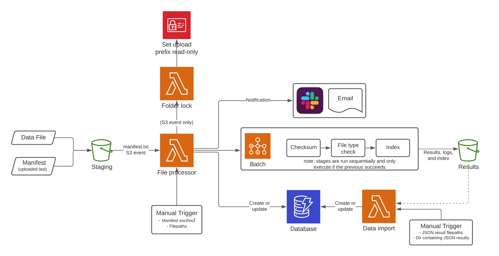

# AGHA data validation stack 1.0 - [ARCHIVE branch]

---
#### This is an archive branch (version 1.0) where the pipeline is initially initiated. The updated version is on the default main branch.

---
This stack is used to handle and validate data received as part of the AGHA GDR project. The primary functions are:
1. take receipt of genomic files in a staging area
2. validate genomic files, and generate indexes if required
3. store file validation results in a database
4. move genomic files to a data store along with indexes _[planned]_
5. generate validation reports _[planned]_

## Table of contents
* [Schematic](#schematic)
* [Prerequisites](#prerequisites)
* [Deployment](#deployment)
* [Usage](#usage)
* [Lambda arguments](#lambda-arguments)
* [Accessory scripts](#accessory-scripts)

## Schematic
<p align="center"></p>

## Prerequisites
It is assumed that the necessary VPC, security groups, and S3 buckets are appropriately deployed and configured in the target
AWS account.

## Deployment
The stack has some software requirements for deploy:
* AWS CDK Toolkit (available through Homebrew or npm)
* Docker
* Python3

### Create virtual environment
```bash
python3 -m venv .venv/
pip install -r requirements.txt
```

### Build Lambda layers
```bash
for dir in $(find ./lambdas/layers/ -maxdepth 1 -mindepth 1 -type d); do
  ./build_lambda_layers.sh ${dir};
done
```

### Build Docker image
Configure
```bash
NAME=agha-gdr-file-validation
VERSION=0.0.1
URI_LOCAL="${NAME}:${VERSION}"
AWS_PROVIDER_URL=602836945884.dkr.ecr.ap-southeast-2.amazonaws.com
AWS_URI_REMOTE="${AWS_PROVIDER_URL}/${NAME}:${VERSION}"
```

Build
```bash
docker build -t "${NAME}" -f assets/Dockerfile .
```

Upload
```bash
# Tag image with remote Docker Hub URI
docker tag "${NAME}" "${AWS_URI_REMOTE}"

# Configure Docker with AWS credentials and upload
aws ecr get-login-password --region ap-southeast-2 | docker login --username AWS --password-stdin "${AWS_PROVIDER_URL}"
docker push "${AWS_URI_REMOTE}"

# Remove unencrypted credentials
rm /Users/stephen/.docker/config.json
```

>Docker Hub was previously used but we enountered issues where Batch instances would timeout before they were able to pull
>the image, which is likely due to request rate limits or limited download connection. These problems were resolved when
>moving the Docker image to ECR.

### Deploy stack
```bash
cdk deploy
```

### Configure S3 event
With the stack deployed, the S3 event for `manifest.txt` upload can be configured on the staging S3 bucket. This is done by:
1. navigating to the 'Properties' tab of the staging bucket
2. creating a new 'Event notification' with:
  * name: 'agha\_manifest\_upload'
  * suffix: `manifest.txt`,
  * event type: 'All object create events'
  * destination: `agha-validation_file_processor_lambda` Lambda function

## Usage
### Automatic triggering
Incoming data should be uploaded under an accepted flagship and date/time stamp directory e.g. `./CARDIAC/20210825/`. The
`manifest.txt` file is expected to be uploaded last, which causes an S3 event to be emitted and received by the File
Processor Lambda function. This Lambda function:

* sets the upload directory to read-only,
* validates the manifest file,
* creates records in DynamoDB, and
* submits file validation Batch jobs

The validation results, logs, and indexes are uploaded to the results S3 bucket using a key prefix matching the input
`manifest.txt` and with run directory e.g. `./CARDIAC/20210825/<rundate>_<runtime>_<uid>/`.

### Data import
Once validation results have been generated by the File Processor Lambda function, these data can be imported into a DynamoDB
table using the Data Import Lambda function. This Lambda function is invoked manually and can be provided either a list of
result file paths or a directory containing result files.

#### Invoke: file paths
```bash
aws lambda invoke \
    --function-name agha-validation_data_import_lambda \
    --cli-binary-format raw-in-base64-out \
    --payload '{
      "bucket_name": "umccr-temp-dev",
      "results_fps": [
        "20210711_170230/20210824_051333_0755318/19W001053.bam__results.json",
        "20210711_170230/20210824_051333_0755318/19W001053.individual.norm.vcf.gz__results.json",
        "20210711_170230/20210824_051333_0755318/19W001056.bam__results.json",
        "20210711_170230/20210824_051333_0755318/19W001056.individual.norm.vcf.gz__results.json"
      ]
    }' \
    response.json
```

#### Invoke: directory path
```bash
aws lambda invoke \
    --function-name agha-validation_data_import_lambda \
    --cli-binary-format raw-in-base64-out \
    --payload '{
      "bucket_name": "umccr-temp-dev",
      "results_dir": "20210711_170230/20210824_051333_0755318/"
    }' \
    response.json
```

### Manual file validation
Files can be resubmitted for validation manually via the File Process Lambda function. Through the manual entry point, the
Lambda function will accept either a list of file paths to process or a manifest file path. When providing a manifest file
path, behaviour is intended to mirror automatic process of the S3 event with the option to specific a list of files to
include or exclude. Conversely, using file paths is for cases where you want to generate indices, checksums, or validate
file type for files that may not be associated with a project, and doing so requires you to also set an output prefix.

The required set of tasks will be automatically determined but this can be overridden with the `tasks` option. When a
DynamoDB record already exists for an input file, the default behaviour is to create a new record. This change by changed to
update the existing record with `record_mode` however, only a partial update of fields is performed and probably needs more
work to be useful.

We currently assume that all input data is in the staging bucket, and output data is always written to the results bucket.

#### Invoke: manifest path
```bash
aws lambda invoke \
    --function-name agha-validation_file_processor_lambda \
    --cli-binary-format raw-in-base64-out \
    --payload '{
      "manifest_fp": "cardiac/20210711_170230/manifest.txt",
      "include_fns": [
        "19W001053.bam",
        "19W001053.individual.norm.vcf.gz",
        "19W001056.bam",
        "19W001056.individual.norm.vcf.gz"
      ]
    }' \
    response.json
```

#### Invoke: file paths
```bash
aws lambda invoke \
    --function-name agha-validation_file_processor_lambda \
    --cli-binary-format raw-in-base64-out \
    --payload '{
      "filepaths": [
        "cardiac/20210711_170230/20210824_051333_0755318/19W001053.bam__results.json",
        "cardiac/20210711_170230/20210824_051333_0755318/19W001053.individual.norm.vcf.gz__results.json",
        "cardiac/20210711_170230/20210824_051333_0755318/19W001056.bam__results.json",
        "cardiac/20210711_170230/20210824_051333_0755318/19W001056.individual.norm.vcf.gz__results.json"
      ],
      "output_prefix": "cardiac/20210711_170230/20210824_manual_run/"
    }' \
    response.json
```

### Interacting with DynamoDB
The compiled validation results in the DynamoDB table can be viewed and modified through the AWS console.

## Lambda arguments
### File processor
| Argument          | Description                                                                                                    |
| ---               | ---                                                                                                            |
| `manifest_fp`     | S3 key for an input manifest file. Cannot be used with `filepaths` or `output_prefix`.                         |
| `filepaths`       | List of S3 keys of input files. Requires `output_prefix`, cannot be used with `manifest_fp`.                   |
| `output_prefix`   | Output S3 key prefix when using `filepaths`, cannot be used with `manifest_fp`.                                |
| `include_fns`     | List of *filenames* to include for validation from `manifest_fp`, all other files excluded.                    |
| `exclude_fns`     | List of *filenames* to exclude for validation form `manifest_fp`, all other file included.                     |
| `record_mode`     | Operation used add result data to database: can be either `create` or `update` [_default:_ `create`].          |
| `email_address`   | Email of submitter (_optional_).                                                                               |
| `email_name`      | Name of submitter (_optional_).                                                                                |
| `tasks`           | List of tasks to run (_optional_). Tasks: `checksum`, `validate_filetype`, `create_index`.                     |
| `strict_mode`     | Run in strict mode: fail on unexpected files, flagship, study ID. Choices `True`, `False` [_default:_ `True`]. |

### Data import
| Argument          | Description                                                                                                        |
| ---               | ---                                                                                                                |
| `bucket_name`     | Name of bucket containing result files.                                                                            |
| `results_dir`     | Results directly containing result JSON files. Cannot be used with `results_fps`.                                  |
| `results_fps`     | List of S3 keys of result JSON filepaths. Cannot be used with `results_dir`.                                       |
| `update_fields`   | Update a specific set of fields only. [_default:_ all].                                                            |
| `strict_mode`     | Run in strict mode: fail on missing update fields or missing records. Choices `True`, `False` [_default:_ `True`]. |

## Accessory scripts
### `query_database.py`
The script provides functionality to perform useful database queries. Query space can be limited by submission name or S3
prefix.

#### Record query
| Query type                            | Description                                          |
| ---                                   | ---                                                  |
| `no_task_run`                         | No tasks run                                         |
| `any_task_run`                        | ≥1 tasks run                                         |
| `tasks_incompleted`                   | ≥1 runnable tasks incomplete                         |
| `tasks_completed`                     | All runnable tasks complete                          |
| `tasks_completed_not_fully_validated` | All tasks run (incl. non-runnable) with ≥1 failed    |
| `fully_validated`                     | All tasks successfully complete (incl. non-runnable) |

#### File query
| Query type   | Description                                                |
| ---          | ---                                                        |
| `has_record` | Files *with* any database record                           |
| `no_record`  | Files *without* any database record                        |

### `dump_database.py`
Simply dump the given DynamoDB table to disk.
