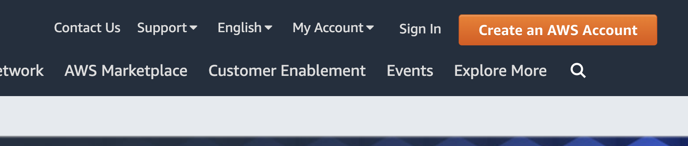
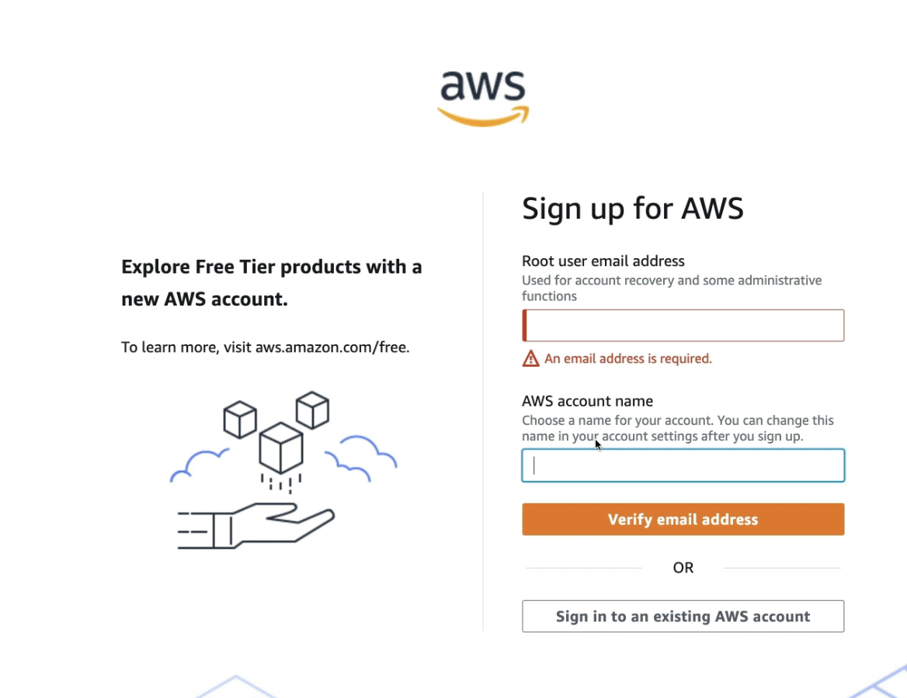
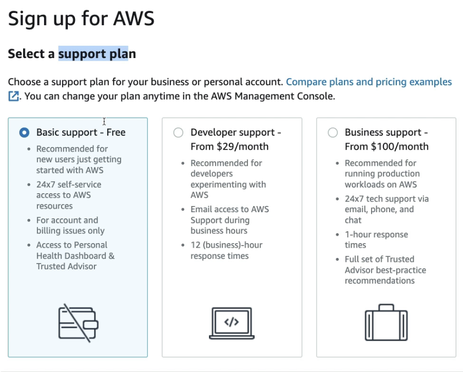
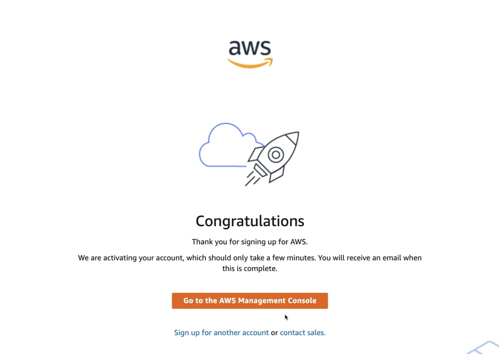
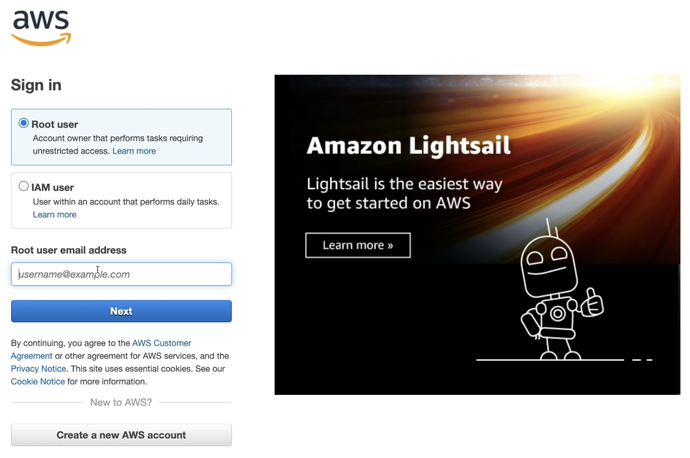
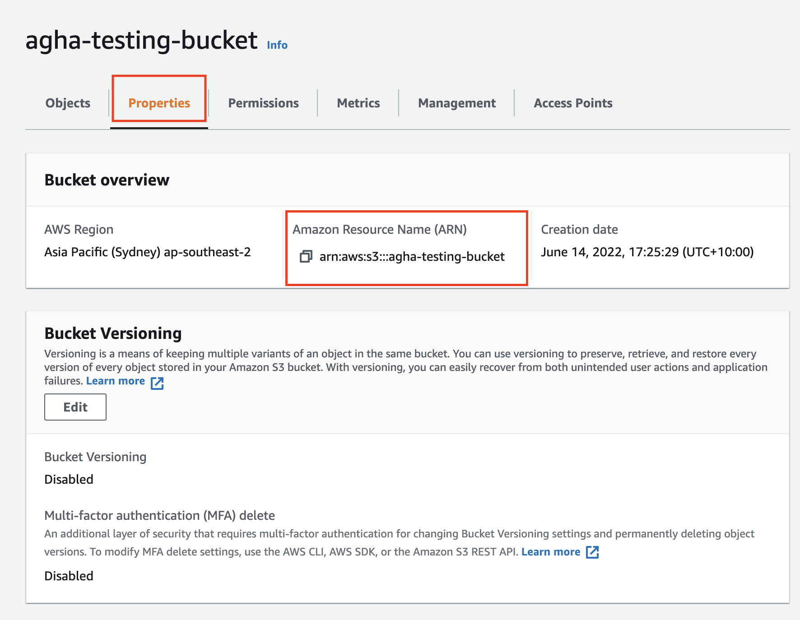
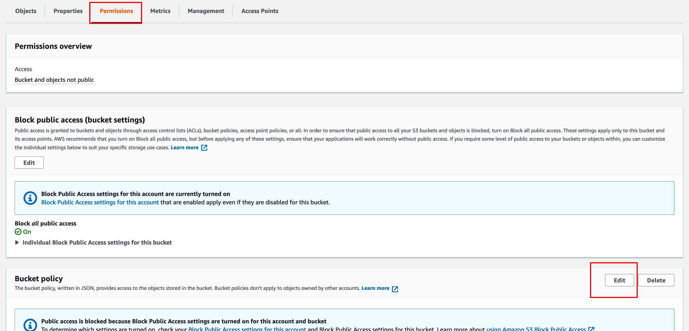

# AWS AGHA-GDR S3 DATA SHARING

This is a step-by-step for AGHA-GDR data sharing via [AWS s3-bucket](https://docs.aws.amazon.com/AmazonS3/latest/userguide/GetStartedWithS3.html) (Cloud storage service). 

The AGHA-GDR data is currently sitting on AWS S3. If we need to share this data outside AWS environment, there will be an egress cost as data will be transferred to the public internet. We would avoid this cost and decided to transfer within aws environment. If you decided to view or process data in AWS, you will not have any egress cost unless you are transfering between regions.  


## Step 1 - Do you have an AWS account?
[Yes, I have. Skipping ...](#step-2---prepare-an-s3-bucket)

In order to transfer to your S3 bucket, you must have an AWS account. Skip if you already have AWS Account.

Get your credit card handy as it is needed for the setup. 

There a lot of existing blogs to setup aws-account. This is the official one from AWS  
https://aws.amazon.com/premiumsupport/knowledge-center/create-and-activate-aws-account/

In summary:
1. Go to https://aws.amazon.com/
2. You clicked on the create an AWS Account button on the top right. 
  <br/><br/>
3. Fill in the form with the information needed. (For support plan, you could choose `Basic support - Free`)
4. <br/> <br/>
5. You may need to verify your account (Check your email). After you have verified the email, go to your aws console.  
  <br/><br/>
  You could click on the `Go to the AWS Management Console` or head back to https://aws.amazon.com/ and click `Sign In` button.
5. Select `Root user` , and fill in the email and password to logged in as a root-user.
  <br/><br/>

6. Your AWS account is created! You are now logged in as a root user (user with all access).


## Step 2 - Prepare an S3 bucket

**TL;DR**  
Prepare an `ap-southeast-2` S3 bucket that will store the data.

___
In AWS, you would need to have permissions in order to create/use/modify services. The services needed for this section is full access to S3 bucket and IAM role permission. If you are in the root-account, you do not need to worry about this.

There is a documentation from AWS and some tutorial provided by AWS. You could have a read through and familiarize with the service.
https://docs.aws.amazon.com/AmazonS3/latest/userguide/GetStartedWithS3.html


### Creating the S3 bucket

1. Search on S3 on the search bar, and open the S3 service console.
2. Click on the `Create bucket` button.
3. Enter a Bucket name, that is globally unique. Meaning no other people will have this name even on different AWS account. There is some bucket naming rules that need to be followed ([Check it here](https://docs.aws.amazon.com/AmazonS3/latest/userguide/bucketnamingrules.html)).
4. Select AWS Region to `Asia Pacific (Sydney) ap-southeast-2`. Do **NOT** miss this step.
5. You leave the rest as default and hit the `Create bucket` button.
6. Your bucket is created!

### Taking the S3 ARN (Amazon Resource Number)
In AWS, every resource is labeled with an ID called Amazon Resource Number. We need this so that we could refer this resource in the future.

1. Click on the S3 bucket with the name you created on top. (Could use search bucket name if needed)
2. On the tabs, click on properties. You could see this arn values. Copy this ARN value
  <br/><br/>


## Step 3 - Permission for the AGHA AWS account to send data to your s3 bucket

**TL;DR**  
Allow AGHA-Service account to upload to S3.  

AWS AGHA account number: `602836945884`

___

Before we can send you the data requested to your S3 bucket. You need to give us access to do so.

### Creating Policy on S3 bucket
We need to create what actions allowed for the permissions.
1. Click on the S3 bucket with the name you created on top. (Could use search bucket name if needed)
2. On the tabs, click on `Permissions`. Scroll to see `Bucket policy`, and click on edit.
  <br/><br/>
3. Copy the following JSON or append with the following policy. Change the `REPLACE_HERE` below (for `Resource`) value with the bucket ARN above. NOTE: One of the `Resource` value has a postfix of `/*`.  
    ```json
    {
      "Version": "2012-10-17",
      "Statement": [
        {
          "Effect": "Allow",
          "Principal": {
              "AWS": "602836945884"
          },
          "Action": [
              "s3:GetObject",
              "s3:PutObject",
              "s3:PutObjectAcl",
              "s3:GetBucketLocation"
          ],
          "Resource": [
            "REPLACE_HERE", 
            "REPLACE_HERE/*"
          ]
      }
      ]
    }
    ```

## Step 4 - Let the AGHA-GDR administrator know

Your account is ready for the file being transferred.

Send us your bucket ARN, and we will be able to copy files over to your bucket.


## Notes

- When we copy the data to your S3 bucket. The data belongs to you, and you will be charge for s3 storage. You could try to save cost if you change S3 classes. Ref: [S3 classes](https://aws.amazon.com/s3/storage-classes/), [S3 pricing](https://aws.amazon.com/s3/pricing/)
- Data transferred within AWS at the same region (ap-southeast-2) will incur no fee, for example you open the file via AWS ec2 (Virtual Machine). But if you decide to download this file somewhere else. This will attract egress cost.